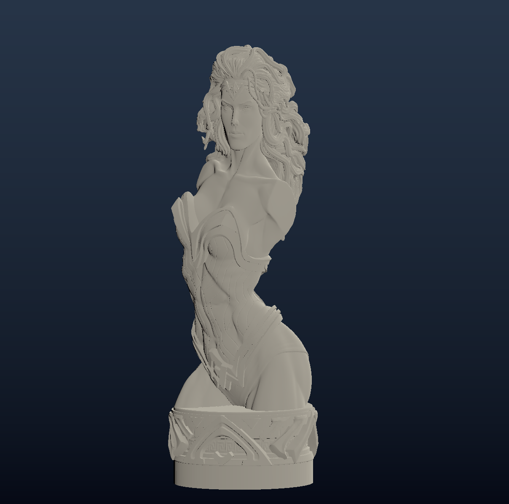

# Hustl
Hustl is a simple, performant STL file viewer. It supports both ASCII and binary format STL files, and uses [wgpu](https://github.com/gfx-rs/wgpu) as its graphics API. It was written to be fast and leverages extensive parallelism/concurrency (with [crossbeam](https://github.com/crossbeam-rs/crossbeam) and [Tokio](https://github.com/tokio-rs/tokio)) with vertex indexing to be able to load to high polygon models nearly instantly.

The 3 million polygon model shown below loads in 270 ms on a Ryzen 3600X with a GeForce GTX 660 GPU. 

# TODO
- [ ] Webassembly pipeline
- [ ] Theme/color selection
- [ ] Camera alignment during startup
- [ ] Wireframe and surface angle shaders
- [ ] Antialiasing